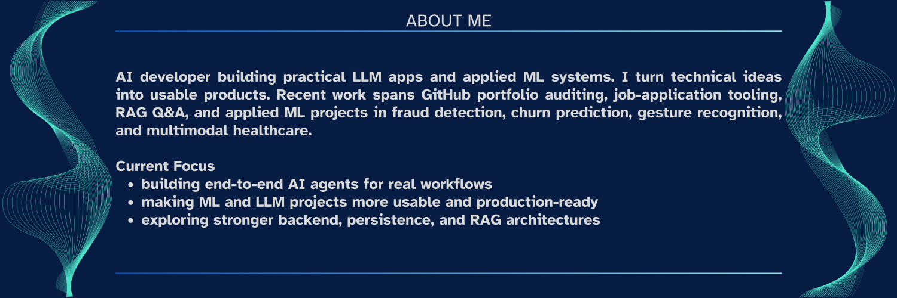
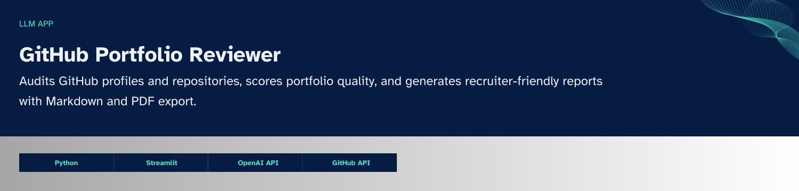
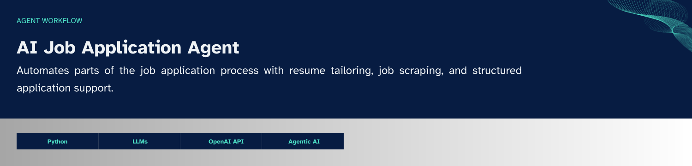
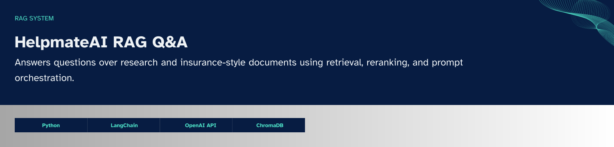

  

---

  

---

## Selected Work

### Featured Projects

  

  
  

  

  

  

  

### Other Projects

- [Multimodal Cancer Detection](https://github.com/LEANDERANTONY/Multimodal_Cancer_Detection): CT ROI extraction, biomarker modelling, and multimodal fusion for cancer detection.
- [Credit Card Fraud Detection](https://github.com/LEANDERANTONY/Credit_Card_Fraud_Detection): Fraud detection on highly imbalanced transaction data using XGBoost and SMOTE.
- [Telecom Churn Case Study](https://github.com/LEANDERANTONY/Telecom_Churn_Case_study): Churn prediction with feature engineering and classification workflows on large telecom datasets.

---

## Stack

---

## GitHub Signals

  

